Dynamic design aspects of the software units
==================================================

Functionality and behaviour
------------------------------
The ADC provides the following services :
 * Initializes and de-initializes the ADC hardware units
 * Initializes ADC with the group specific result buffer
 * Get the version information of the module
 * Starts and stops the conversion of all channels of the requested ADC Channel group
 * Reads the group conversion result
 * Enables and disables the hardware trigger for the requested ADC Channel group
 * Enables and disables the notification mechanism for the requested ADC Channel group
 * Gets the conversion status and the number of valid samples per channel
 * Sets the power state of ADC HW unit

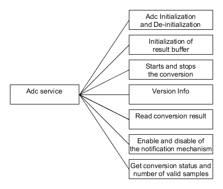

|
|

Control flow and concurrency of processes
-------------------------------------------------

All routines are re-entrant and can be used by multiple applications at the same time.
The ADC provides error classification. Errors can be classified as development errors, run time errors, transient errors and production errors. ADC doesn't have run time errors, transient faults or production errors.
The ADC provides error detection mechanism and provides error notification.

|
|

List of parameters
^^^^^^^^^^^^^^^^^^^^^^

The parameters that each API should check are listed below. If the parameter check fails then the function should report with the corresponding error code.

+----------------------------+-------------------------------------------------------------------------------------+-------------------------------------------+
|       API                  |  Parameter Check                                                                    |  Error Code                               |
+============================+=====================================================================================+===========================================+
|Adc_Init                    |Adc_Init has been called while ADC is already initialized                            |ADC_E_ALREADY_INITIALIZED                  |
|                            +-------------------------------------------------------------------------------------+-------------------------------------------+
|                            |Adc_Init called with incorrect configuration pointer                                 |ADC_E_PARAM_POINTER                        |
+----------------------------+-------------------------------------------------------------------------------------+-------------------------------------------+
|Adc_DeInit                  |Called prior to initialization                                                       |ADC_E_UNINIT*                              |
|                            +-------------------------------------------------------------------------------------+-------------------------------------------+
|                            |Called while conversion is running                                                   |ADC_E_BUSY                                 |
+----------------------------+-------------------------------------------------------------------------------------+-------------------------------------------+
|Adc_StartGroupConversion    |Function called prior to initialization.                                             |ADC_E_UNINIT*                              |
|                            +-------------------------------------------------------------------------------------+-------------------------------------------+
|                            |1. Function called while any group is not in state ADC_IDLE.                         |ADC_E_BUSY                                 |
|                            |2. Function called while conversion request already stored in queue.                 |                                           |
|                            |3. Function called while conversion of same group is already running.                |                                           |
|                            +-------------------------------------------------------------------------------------+-------------------------------------------+
|                            |Function called with non existing group.                                             |ADC_E_PARAM_GROUP                          |
|                            +-------------------------------------------------------------------------------------+-------------------------------------------+
|                            |Function called for a group configured for hardware trigger source.                  |ADC_E_WRONG_TRIGG_SRC                      |
|                            +-------------------------------------------------------------------------------------+-------------------------------------------+
|                            |Function called while result buffer pointer is not initialized.                      |ADC_E_BUFFER_UNINIT                        |
+----------------------------+-------------------------------------------------------------------------------------+-------------------------------------------+
|Adc_StopGroupConversion     |Function called prior to initialization.                                             |Dio_E_UNINIT*                              |
|                            +-------------------------------------------------------------------------------------+-------------------------------------------+
|                            |Function called while group is in state ADC_IDLE.                                    |ADC_E_IDLE                                 |
|                            +-------------------------------------------------------------------------------------+-------------------------------------------+
|                            |Function called with non existing group.                                             |ADC_E_PARAM_GROUP                          |
|                            +-------------------------------------------------------------------------------------+-------------------------------------------+
|                            |Function called for a group configured for hardware trigger source.                  |ADC_E_WRONG_TRIGG_SRC                      |
+----------------------------+-------------------------------------------------------------------------------------+-------------------------------------------+
|Adc_GetGroupStatus          |Function called prior to initialization.                                             |ADC_E_UNINIT                               |
|                            +-------------------------------------------------------------------------------------+-------------------------------------------+
|                            |Function called with non existing group.                                             |ADC_E_PARAM_GROUP                          |
+----------------------------+-------------------------------------------------------------------------------------+-------------------------------------------+
|Adc_ReadGroup               |Function called prior to initialization.                                             |ADC_E_UNINIT                               |
|                            +-------------------------------------------------------------------------------------+-------------------------------------------+
|                            |Function called with non existing group.                                             |ADC_E_PARAM_GROUP                          |
|                            +-------------------------------------------------------------------------------------+-------------------------------------------+
|                            |Function called while group status is ADC_IDLE.                                      |ADC_E_IDLE                                 |
+----------------------------+-------------------------------------------------------------------------------------+-------------------------------------------+
|Adc_EnableGroupNotification |Function called prior to initialization.                                             |ADC_E_UNINIT                               |
|                            +-------------------------------------------------------------------------------------+-------------------------------------------+
|                            |Function called with non existing group.                                             |ADC_E_PARAM_GROUP                          |
|                            +-------------------------------------------------------------------------------------+-------------------------------------------+
|                            |Function called while group status is ADC_IDLE.                                      |ADC_E_NOTIF_CAPABILITY                     |
+----------------------------+-------------------------------------------------------------------------------------+-------------------------------------------+
|Adc_DisableGroupNotification|Function called prior to initialization.                                             |ADC_E_UNINIT                               |
|                            +-------------------------------------------------------------------------------------+-------------------------------------------+
|                            |Function called with non existing group.                                             |ADC_E_PARAM_GROUP                          |
|                            +-------------------------------------------------------------------------------------+-------------------------------------------+
|                            |Function called while group status is ADC_IDLE.                                      |ADC_E_IDLE                                 |
+----------------------------+-------------------------------------------------------------------------------------+-------------------------------------------+
|Adc_SetupResultBuffer       |Function called prior to initialization.                                             |ADC_E_UNINIT                               |
|                            +-------------------------------------------------------------------------------------+-------------------------------------------+
|                            |Function called with non existing group.                                             |ADC_E_PARAM_GROUP                          |
|                            +-------------------------------------------------------------------------------------+-------------------------------------------+
|                            |Function called while group status is ADC_IDLE.                                      |ADC_E_BUSY                                 |
|                            +-------------------------------------------------------------------------------------+-------------------------------------------+
|                            |Function called and DataBufferPtr is NULL_PTR.                                       |ADC_E_PARAM_POINTER                        |
+----------------------------+-------------------------------------------------------------------------------------+-------------------------------------------+
|Adc_GetStreamLastPointer    |Function called prior to initialization.                                             |ADC_E_UNINIT                               |
|                            +-------------------------------------------------------------------------------------+-------------------------------------------+
|                            |Function called with non existing group.                                             |ADC_E_PARAM_GROUP                          |
|                            +-------------------------------------------------------------------------------------+-------------------------------------------+
|                            |Function called while group status is ADC_IDLE.                                      |ADC_E_IDLE                                 |
+----------------------------+-------------------------------------------------------------------------------------+-------------------------------------------+
|Adc_GetVersionInfo          |Function called with NULL pointer.                                                   |ADC_E_PARAM_POINTER                        |
+----------------------------+-------------------------------------------------------------------------------------+-------------------------------------------+
 \*The Dio_E_UNINT is a ArcCore error code to provide backward compatibility with 4.1. 

|
|

Control flow  diagram
^^^^^^^^^^^^^^^^^^^^^^
 
The control flow diagram of each API is depicted below. 
As described in Table of parameters each API may return development errors if development error detection is enabled.

|
|

Adc_Init control flow diagram:

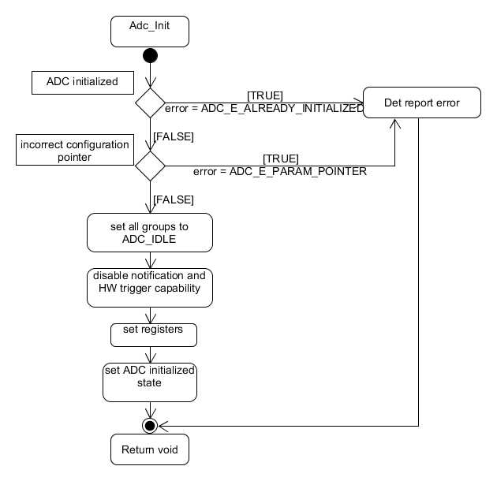

|
|

Adc_DeInit control flow diagram:

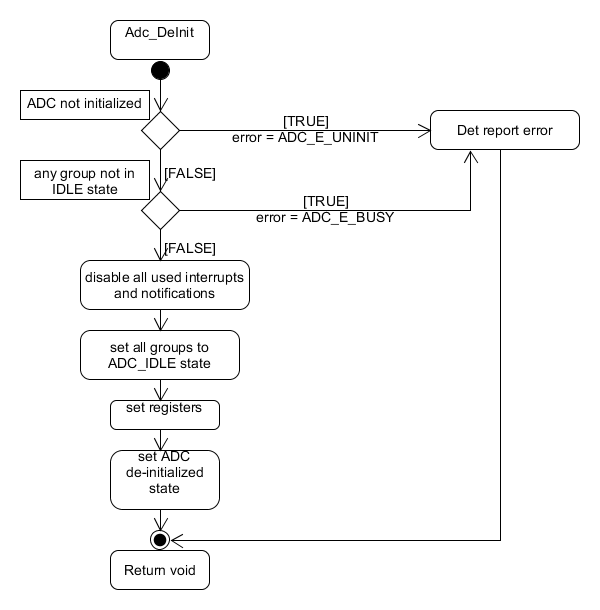

|
|

Adc_SetResultBuffer control flow diagram:

.. image:: pictures/Adc_SetupResultBuffer_controlflow.png

|
|

Adc_StartGroupConversion control flow diagram:

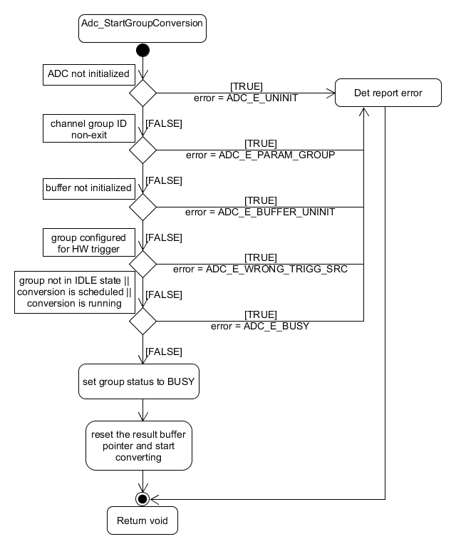

|
|

Adc_StopGroupConversion control flow diagram:

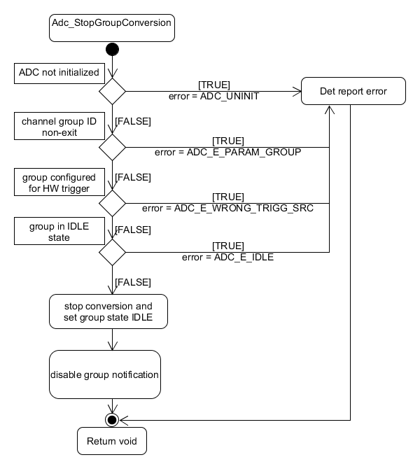

|
|

Adc_ReadGroup control flow diagram:

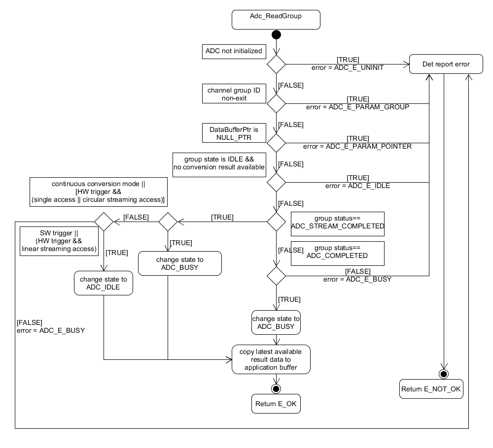

|
|

Adc_EnableGroupNotification control flow diagram:

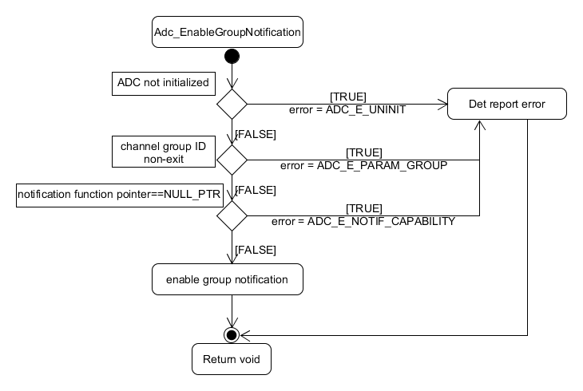

|
|

Adc_DisableGroupNotification control flow diagram:

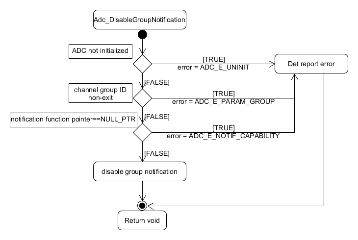
 
|
|

Adc_GetGroupStatus control flow diagram:

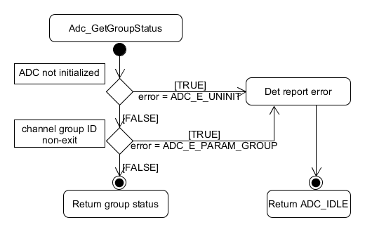

|
|  

Adc_GetStreamLastPointer control flow diagram:

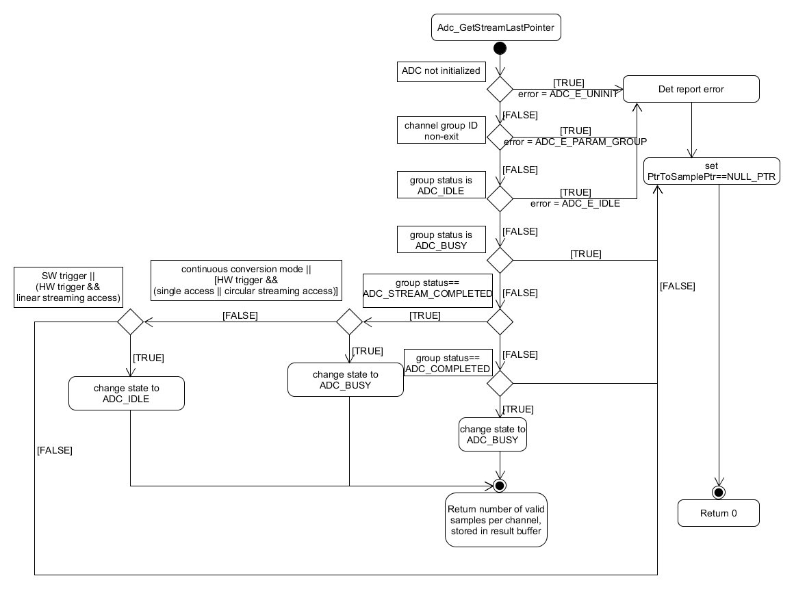

|
|  

Adc_GetVersionInfo control flow diagram:

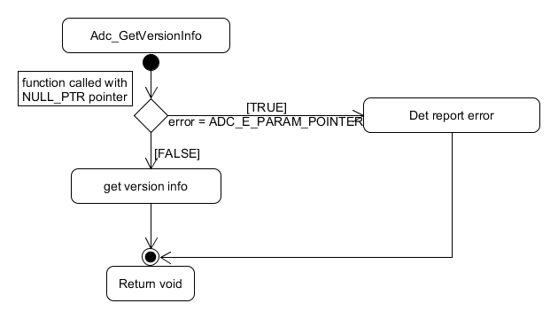
  
 