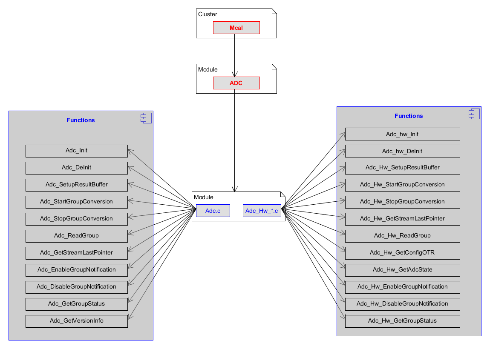

User Guide
===================

Functional overview
--------------------

The diagram below identifies the ADC functions, and the structure of the module, unit and functions within the MCAL software layer.

|
|

Internal Design
^^^^^^^^^^^^^^^^^^
The general features about the API's and the internal design are provided below.

 * There are no call back notifications
 * There is 1 scheduled function
 * Adc_Main_PowerTransitionManager: This API is cyclically called and supervises the power state transitions, checking for the readiness of the module and issuing the callbacks IoHwAb_Adc_NotifyReadyForPowerState<Mode>
 * There are no dynamic variables
 * There are no implicit type conversions
 * There are no hidden data or control flows
 * There are no unconditional jumps
 * The units don't have recursive function calls
