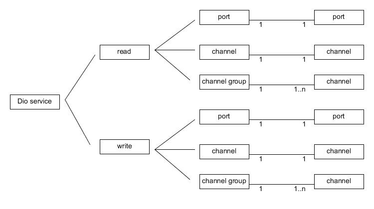
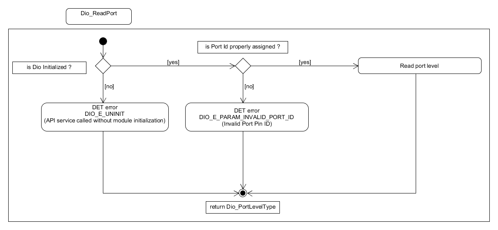
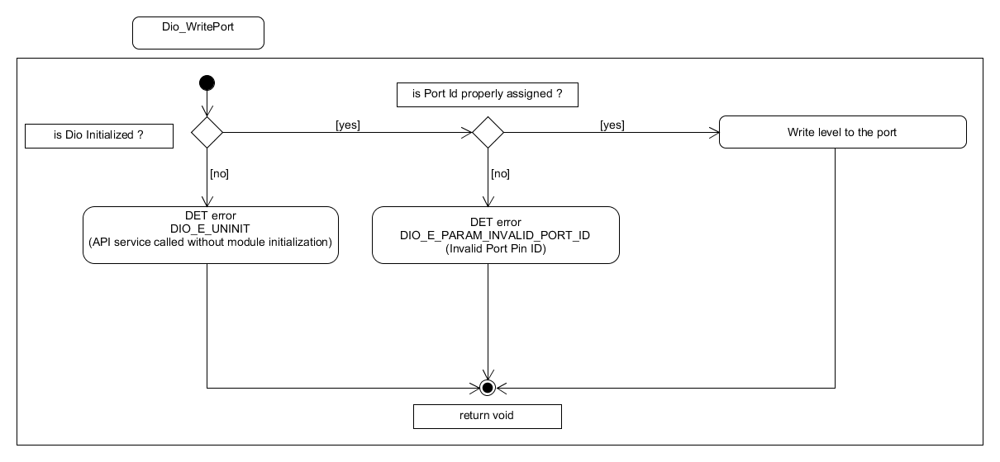
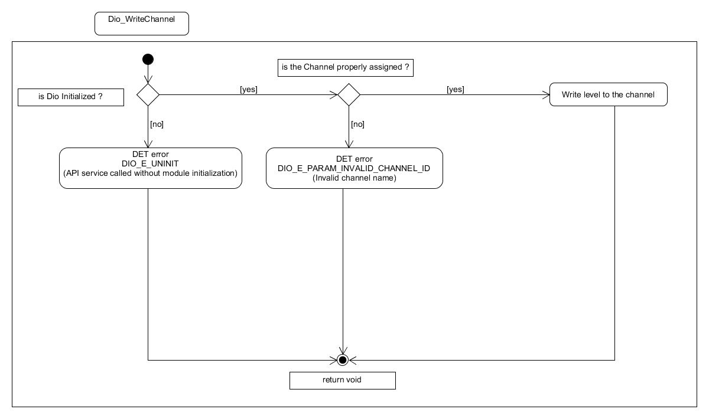
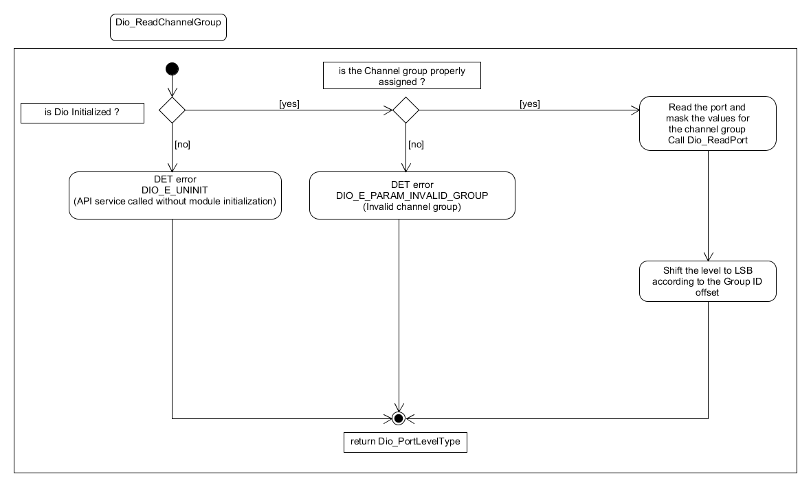
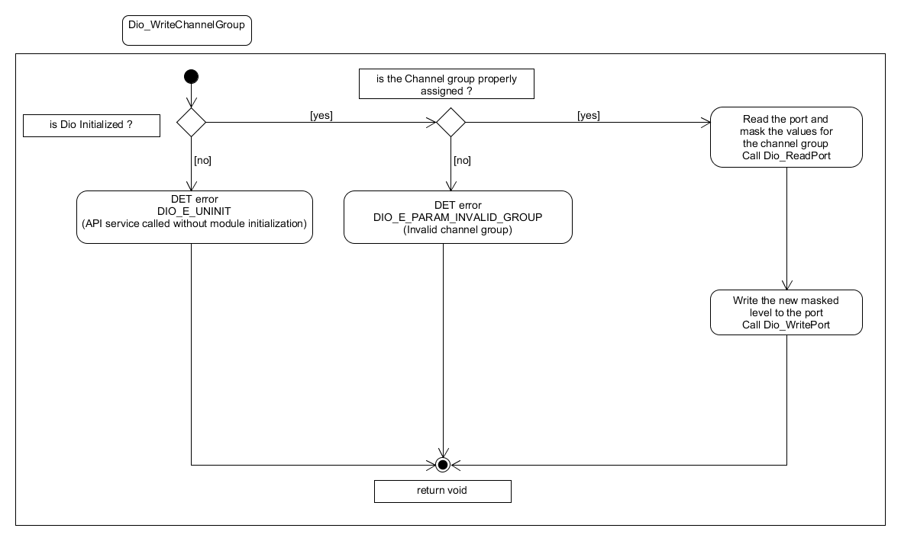

Dynamic design aspects of the software units
==================================================

??????????????????????????????????????????????

Functionality and behaviour
------------------------------
The Dio Driver provides the following services :
 * The Dio SWS defines functions to modify the levels of output channels individually, for a port or for a channel group.
 * The Dio SWS defines functions to read the level of input and output channels individually, for a port or for a channel group.
 * A channel group can have more than 1 channel. Read channel group and write channel group are supported.

|
|

Control flow and concurrency of processes
-------------------------------------------------

All routines are re-entrant and can be used by multiple applications at the same time.

|
|

List of parameters
^^^^^^^^^^^^^^^^^^^^^^

The parameters that each API should check are listed below. If the parameter check fails then the function should report with the corresponding error code.

+-------------------------+---------------------------------------+-------------------------------+
|       API               |  Parameter Check                      |  Error Code                   |
+=========================+=======================================+===============================+
|  Dio_ReadChannel        |Check whether DIO is initialized       |Dio_E_UNINIT*                  |
|                         +---------------------------------------+-------------------------------+
|  Dio_WriteChannel       |Channel parameters to be valid         |Dio_E_PARAM_INVALID_CHANNEL_ID |
|                         |within current configuration           |                               |
+-------------------------+---------------------------------------+-------------------------------+
|Dio_ReadPort             |Check whether DIO is initialized       |Dio_E_UNINIT*                  |
|                         +---------------------------------------+-------------------------------+
|Dio_WritePort            |Port parameters to be valid within     |Dio_E_PARAM_INVALID_PORT_ID    |
|                         |current configuration                  |                               |
+-------------------------+---------------------------------------+-------------------------------+
|Dio_ReadChannelGroup     |Check whether DIO is initialized       |Dio_E_UNINIT*                  |
|                         +---------------------------------------+-------------------------------+
|Dio_WriteChannelGroup    |ChannelGroupPtr parameters to          |Dio_E_PARAM_INVALID_GROUP      |
|                         |be valid within current configuration  |                               |
+-------------------------+---------------------------------------+-------------------------------+
|Dio_GetVersionInfo       |Check whether DIO is initialized       |Dio_E_UNINIT*                  |
|                         +---------------------------------------+-------------------------------+
|                         |Check the pointer is NULL              |Dio_E_PARAM_POINTER            |
|                         |                                       |                               |
+-------------------------+---------------------------------------+-------------------------------+
 \*The Dio_E_UNINT is a ArcCore error code to provide backward compatibility with 4.1. 

|
|

Control flow  diagram
^^^^^^^^^^^^^^^^^^^^^^
 
The control flow  diagram for DIO Read /Write ports, DIO Read channel, DIO Write channel, DIO Read channel group and DIO Write channel group are given below

As described, port ID should be valid before executing the read or write port. These checks are mentioned in the following figures.

|

Flow chart when using Dio_Read:

Flow chart when using Dio_Write:

Control Flow diagram of Dio Read Channel:

.. image:: pictures/Dio_ReadChannel_ControlFlow.png

Control Flow diagram of Dio Write Channel:

Control Flow diagram of Dio Read Channel Group:

Control Flow diagram of Dio Write Channel Group:

 