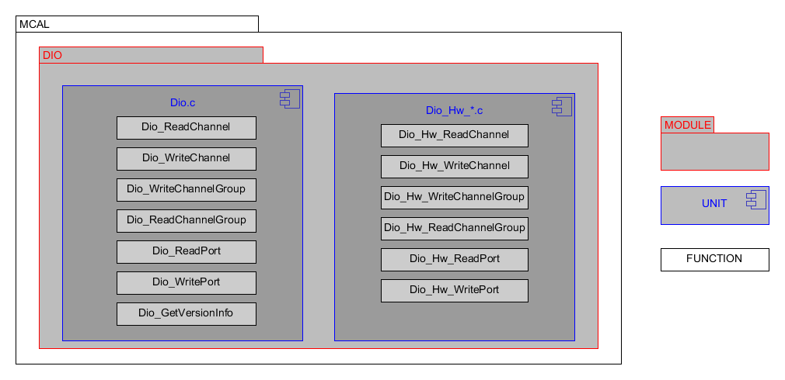

Introduction
==============

This is a design description of the Arccore MCAL.
This specification specifies the functionality, API and the configuration of the AUTOSAR BSW Dio .This specification is applicable to drivers only for on chip DIO pins and ports.

The Dio provides services for reading and writing to/from
 * Dio Channels (Pins)
 * Dio Ports
 * Dio Channel Groups

The behavior of those services is synchronous.This module works on pins and ports which are configured by the Port for this purpose. 
For this reason, there is no re-configuration and re-initialization of this port structure again in the Dio as it has been already configured and initialized in Port.

 

Static design aspects of the software units
==================================================

Software structure including its hierarchical levels
------------------------------------------------------------
Here you can see the structure of software and relation between Unit, Modules and functions.

 

|
|
Data types and their characteristics
----------------------------------------
The Dio has its own type definitions and also uses imported types.
The imported types and its own type are described in chapter 8 "Specification of Dio Driver" of AUTOSAR requirements, Specifications of DIO Driver, ID: 020.

|
|
External interfaces of the software units
------------------------------------------------
Detailed information of APIs is described in chapter 8 "Specification of Dio Driver" of AUTOSAR requirements, Specifications of DIO Driver, ID: 020.

|
|
Constraints including the scope of the architecture and external dependencies
-----------------------------------------------------------------------------------
 * Most of the parts are generic since the header file defines the registers.
 * The Dio.c file contains the generic implementation of all the API mentioned in DIO driver SWS document (ASR 4.3.0)
 * The hardware specific implementations are done in DIO_Hw_* .c file (depends on the architecture).
 * Each API will have the Det error check mentioned in Dio driver SWS document and will call the the hardware specific implementation function if the check passes.

|
|
Dependencies to other modules
--------------------------------

The legacy drivers in Arccore used to be one .c file for each driver. 
Improvements/bugs then affected one driver for each MCAL.
That was not very maintainable and there is always a risk that something is missed.
So it was decided to divide driver two different parts, one generic and one MCAL specific.
 |
 |
File strucure for <mcu>
--------------------------------

The file structure is defined by Autosar. see autosar_bsw

.. list-table:: List of MCAL files
  :widths: 50  50
  :header-rows: 1
  :align: left

  * - Generic files
    - MCAL specific files
  * - Dio.c
    - Dio_Hw_mpc5xxx.c
  * - 
    - Dio_Hw_tms570.c

The MCAL specific DD should list *<module name>* and *<arch name>*

