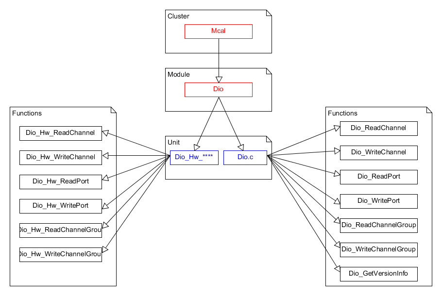

User Guide
===================

Functional overview
--------------------

The DIO provides services for reading and writing to/from
 * DIO Channels (Pins)
 * DIO Ports
 * DIO Channel Groups
 
The behavior of those services is synchronous.This module works on pins and ports which are configured by the Port for this purpose. 
For this reason, there is no re-configuration and re-initialization of this port structure again in the DIO as it has been already configured and initialized in Port.

The diagram below identifies the Dio functions, and the structure of the module, unit and functions within the MCAL software layer.

A DIO channel is single general purpose digital I/O pin. 

A DIO port are several channels that are grouped by hardware and controlled by one hardware register. 
For example NXP MPC5xxx names its ports, port A, port B etc, and references to individual channels within that that port  
are indexed, e.g. A[2]. 

A DIO channel group is when you mask individual channels in a DIO port. The DIO channels must be adjoined. 

The bit value '0' represents low value (normally ground) and '1' represents a high value (3.3V, 5V, etc)
 

