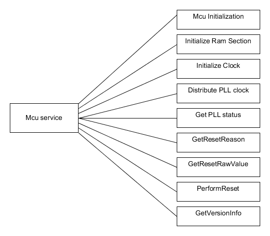
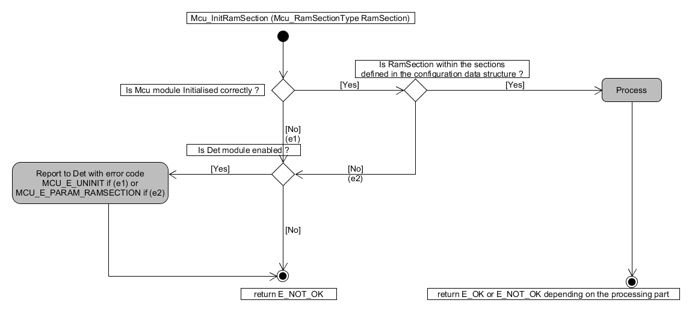
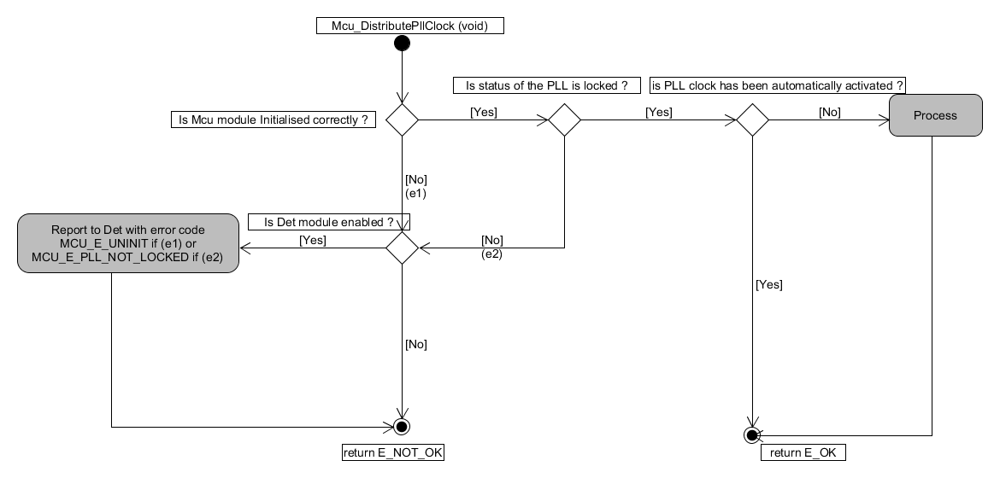
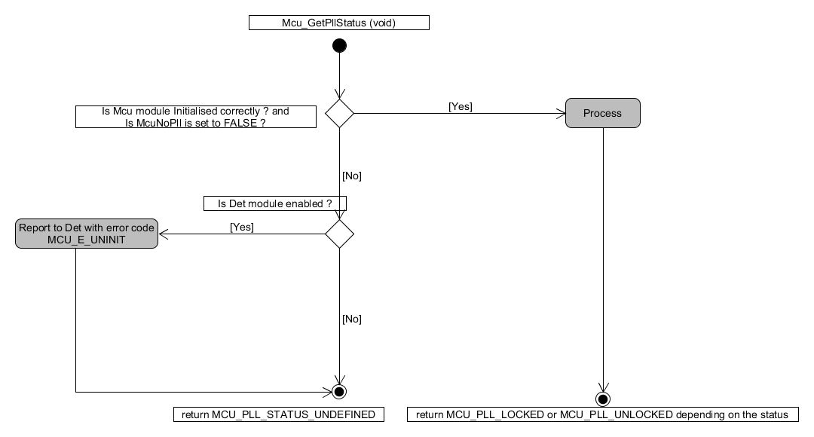
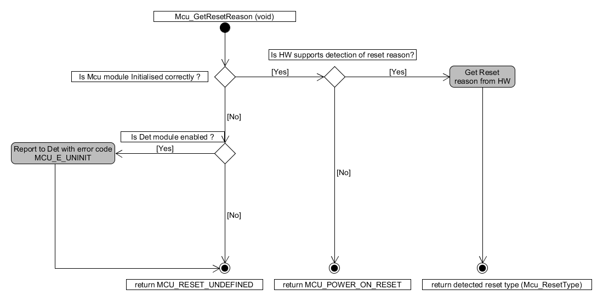
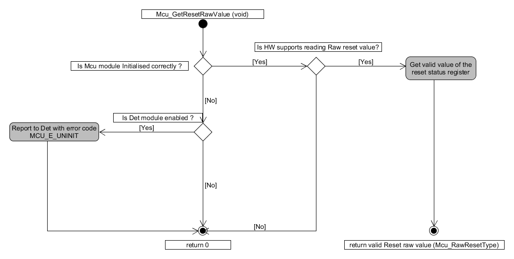
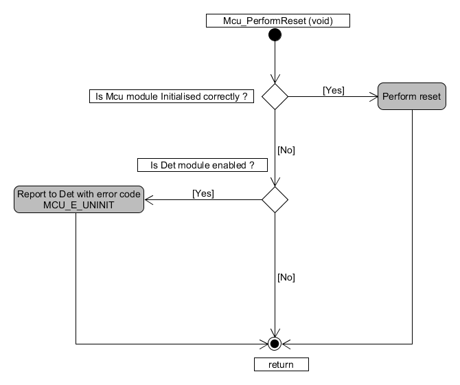

Dynamic design aspects of the software units
==================================================

Functionality and behaviour
------------------------------
Mcu provides the following services :
 * Initialize the RAM section, PLL and other Mcu specific clock options.
 * Activate PLL clock to the Mcu clock distribution and provide lock status of the PLL.
 * Service reads the reset type from the hardware and service to read reset type from the hardware register.
 * Service to perform a microcontroller reset.

Control flow and concurrency of processes
-------------------------------------------------

 * There are no scheduled functions in MCU driver and there are no call back notifications implemented in MCU driver.
 * The reentrancy and synchronous/asynchronous mechanism of the APIs are shown in Table below.
 * APIs Mcu_GetPllStatus,Mcu_GetResetReason,Mcu_GetResetRawValue and Mcu_GetVersionInfo are re-entrant functions and are needed to be protected with concurrent access
 * Mcu_Init is the first call by user to initialize the Mcu module.

Also see the section "Logical sequence of data processing" on how the processing takes place inside the Mcu SW units 

.. list-table:: Reentrancy and execution mechanism of the APIs
  :widths: 45 15  40
  :header-rows: 1
  :align: left

  * - API Name
    - Reentrant
    - Synchronous/Asynchronous
  * - Mcu_Init
    - No
    - Synchronous
  * - Mcu_InitRamSection
    - No
    - Synchronous
  * - Mcu_InitClock
    - No
    - Synchronous
  * - Mcu_DistributePllClock
    - No
    - Synchronous
  * - Mcu_PerformReset
    - No
    - Synchronous
  * - Mcu_GetPllStatus
    - Yes
    - Synchronous
  * - Mcu_GetResetReason
    - Yes
    - Synchronous
  * - Mcu_GetResetRawValue
    - Yes
    - Synchronous
  * - Mcu_GetVersionInfo
    - Yes
    - Synchronous

List of parameters
^^^^^^^^^^^^^^^^^^^^^^

The parameters that each API should check are listed below. If the parameter check fails then the function should report with the corresponding error code.

+-------------------------+--------------------------------------------------+---------------------+
|       API               |  Parameter Check                                 |  Error Code         |
+=========================+==================================================+=====================+
|Mcu_Init                 |If the configuration parameter is passed is NULL  |MCU_E_PARM_POINTER   |
+-------------------------+--------------------------------------------------+---------------------+
|Mcu_InitRamSection       |If Mcu module is called before Mcu_Init function  |MCU_E_UNINIT*        |
|                         +--------------------------------------------------+---------------------+
|                         |If RamSection is not within the sections defined  |MCU_E_PARM_RAMSECTION|
|                         |                                                  |                     |
|                         |in the configuration data structure.              |                     |
+-------------------------+--------------------------------------------------+---------------------+
|Mcu_InitCock             |If Mcu module is called before Mcu_Init function  |MCU_E_UNINIT*        |
|                         +--------------------------------------------------+---------------------+
|                         |If McuMode is not within the modes defined in the |MCU_E_PARAM_MODE     |
|                         |                                                  |                     |
|                         |configuration data structure.                     |                     |
+-------------------------+--------------------------------------------------+---------------------+
|Mcu_DistributePllCock    |If Mcu module is called before Mcu_Init function  |MCU_E_UNINIT*        |
|                         +--------------------------------------------------+---------------------+
|                         |If the status of the PLL is detected as not locked|MCU_E_PLL_NOT_LOCKED |
+-------------------------+--------------------------------------------------+---------------------+
|Mcu_GetPllStatus         |If Mcu module is called before Mcu_Init function  |MCU_E_UNINIT*        |
+-------------------------+--------------------------------------------------+---------------------+
|Mcu_GetResetReason       |If Mcu module is called before Mcu_Init function  |MCU_E_UNINIT*        |
+-------------------------+--------------------------------------------------+---------------------+
|Mcu_GetResetRawValue     |If Mcu module is called before Mcu_Init function  |MCU_E_UNINIT*        |
+-------------------------+--------------------------------------------------+---------------------+
|Mcu_PerformReset         |If Mcu module is called before Mcu_Init function  |MCU_E_UNINIT*        |
+-------------------------+--------------------------------------------------+---------------------+
|Mcu_SetMode              |If Mcu module is called before Mcu_Init function  |MCU_E_UNINIT*        |
|                         +--------------------------------------------------+---------------------+
|                         |If McuMode is not within the modes defined in the |MCU_E_PARAM_MODE     |
|                         |                                                  |                     |
|                         |configuration data structure.                     |                     |
+-------------------------+--------------------------------------------------+---------------------+
  \*The MCU_E_UNINT is a ArcCore error code to provide backward compatibility with 4.1. 

Control flow  diagram
^^^^^^^^^^^^^^^^^^^^^^

Below shown the control flow of the corresponding Mcu API request and re-entrant functions are protected for concurrent access.

Control flow of Mcu_InitRamSection:

|
|

Control flow of Mcu_InitCock :

|
|

Control flow of Mcu_DistributePllCock:

|
|

Control flow of Mcu_GetPllStatus :

|
|

Control flow of Mcu_GetResetReason :

|
|

Control flow of Mcu_GetResetRawValue:

|
|

Control flow of Mcu_PerformReset :

 