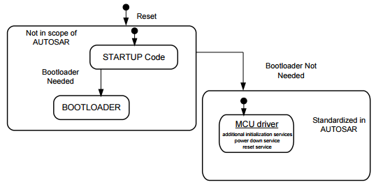

User Guide
===================

Source code and compilation
--------------------------------

The MCAL modules are delivered as source code by ARCCORE. As a customer you must ensure that the source code files are not modified, except for these files that generated by the configuration tool: 
Mcu_Cfg.h, Mcu_Lcfg.c and Mcu_PBcfg.c. 
For ARCCORE ASIL-D classification of the software to be valid, the software should be compiled with the same compiler as used in ARCCORE testing.  Refer to the test report provided by ARCCORE for the MPC5744P microcontroller and gcc compiler.

|
|

Functional overview
--------------------

The Mcu driver accesses the microcontroller hardware directly and is located in the layer Microcontroller Abstraction layer (MCAL) of AUTOSAR Basic Software (BSW).The MCU driver provides services for basic microcontroller initialization, powerdown functionality, reset and microcontroller specific functions required by other MCAL software modules.The initialization services allow a flexible and application related Mcu initialization in addition to the start-up code.
The start-up code is MCU specific.

|

Mcu driver Features: 
 * Configuring the functionality that is not presently covered by another MCAL module e.g. global clock settings 
 * Set up of PLL and Mcu clock distribution 
 * Service for RAM section initialization 
 * Activation of µC reduced power modes 
 * Performing a µC reset 
 * To provide the reset reason from hardware

|
|

As seen below, Mcu code initialization is able to start after micro controller specific start-up code has run.

