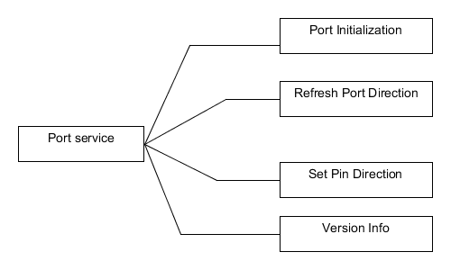
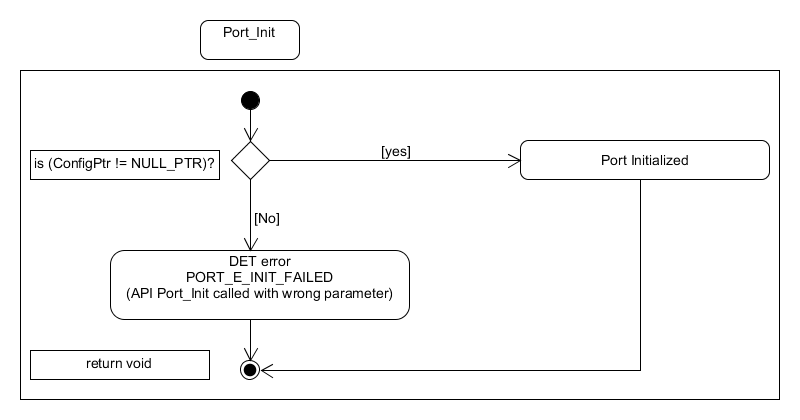
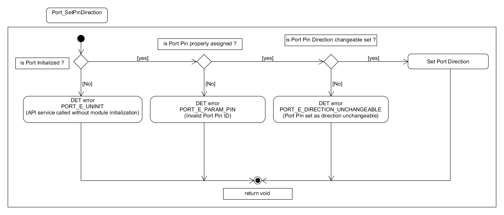
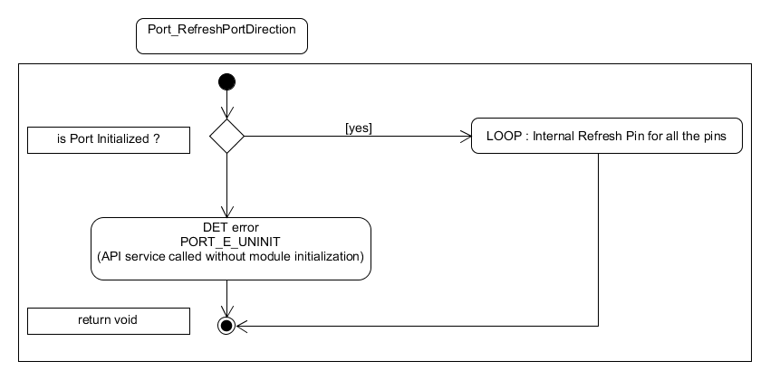
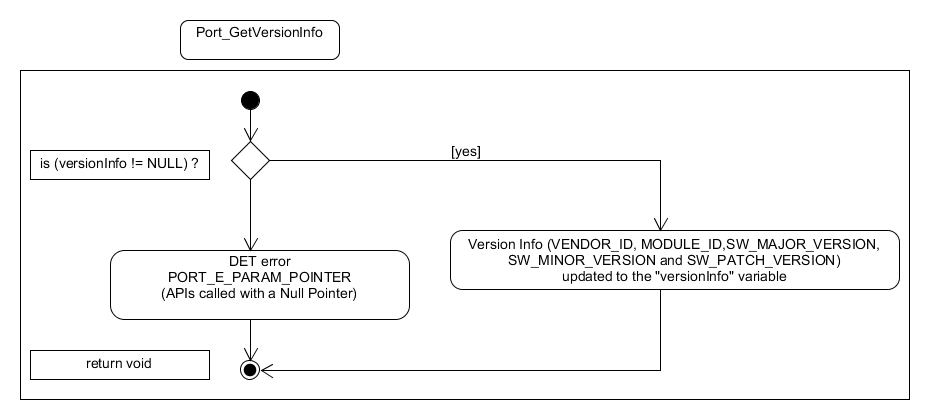

Dynamic design aspects of the software units
==================================================

Functionality and behaviour
------------------------------
The Port provides the following services :
 * The Port initializes the port structure (AUTOSAR) for the usage of peripherals.
 * The Port sets the port pin direction and port pin mode.

Control flow and concurrency of processes
-------------------------------------------------

Functions corresponding to port initialization and port direction refresh are non re-entrant.
Other entities are re-entrant and can be used by multiple applications at the same time.

 * The Port provide  error classification. Errors can be classified as development errors, transient errors and production errors. Port doesn't have run time errors, transient faults and production errors.
 * The Port provide error detection mechanism.
 * The Port provide error notification.
 * The Port does not have scheduled functions.

List of parameters
^^^^^^^^^^^^^^^^^^^^^^

The parameters that each API should check are listed below. If the parameter check fails then the function should report with the corresponding error code.

+-------------------------+---------------------------------------+-------------------------------+
|       API               |  Parameter Check                      |  Error Code                   |
+=========================+=======================================+===============================+
|Port_SetPinDirection     |Incorrect port pin ID passed           |PORT_E_PARAM_PIN               |
|                         +---------------------------------------+-------------------------------+
|                         |Port pin not configured as changeable  |PORT_E_DIRECTION_UNCHANGEABLE  |
|                         +---------------------------------------+-------------------------------+
|                         |Port module initialization check       |PORT_E_UNINIT*                  |
+-------------------------+---------------------------------------+-------------------------------+
|Port_Init                |Check the parameter that is passed     |PORT_E_INIT_FAILED             |
+-------------------------+---------------------------------------+-------------------------------+
|Port_SetPinMode          |Correctness of the port pin ID         |PORT_E_PARAM_PIN               |
|                         +---------------------------------------+-------------------------------+
|                         |Check the validity of the port pin mode|PORT_E_PARAM_INVALID_MODE      |
|                         +---------------------------------------+-------------------------------+
|                         |Check the mode whether it is changeable|PORT_E_MODE_UNCHANGEABLE       |
|                         |or not                                 |                               |
|                         +---------------------------------------+-------------------------------+
|                         |Port module initialization check       |PORT_E_UNINIT*                  |
+-------------------------+---------------------------------------+-------------------------------+
|Port_RefreshPortDirection|Port module initialization check       |PORT_E_UNINIT*                  |
+-------------------------+---------------------------------------+-------------------------------+
|Port_GetVersionInfo      |API called with NULL pointer parameter |PORT_E_PARAM_POINTER           |
+-------------------------+---------------------------------------+-------------------------------+
  \*The Port_E_UNINT is a ArcCore error code to provide backward compatibility with 4.1. 

Control flow  diagram
^^^^^^^^^^^^^^^^^^^^^^
 

The control flow diagram for Port_Init, Port_SetPinDirection ,Port_RefreshPortDirection and Port_GetVersionInfo are given below.

As described in the parameters are checked when the functions are called. If the check is failed Det error is reported.

Control flow diagram for Port Initialization:

Control flow diagram for Set Port Pin Direction:

Control flow diagram for Refresh Port Direction:

Control flow diagram for Get Version Info :

 