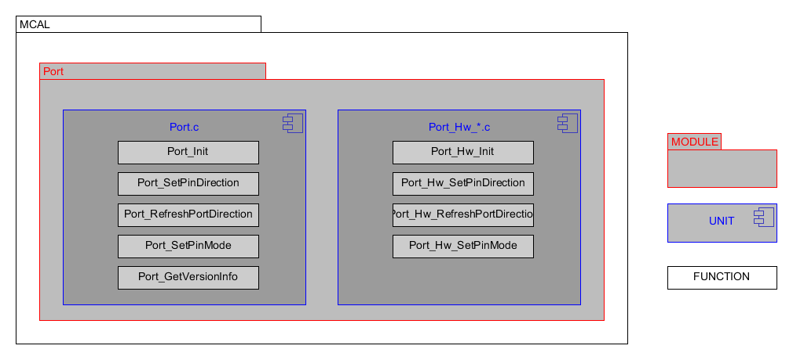

Introduction
================

This is a design description of the Arccore MCAL.
This document specifies the functionality, API and the configuration of the AUTOSAR BSW Port .
This driver specification is applicable for on-chip ports and port pins.

Static design aspects of the software units
==================================================

Software structure including its hierarchical levels
------------------------------------------------------------

The diagram below describing the software structur.

 

Data types and their characteristics
----------------------------------------
The Port has its own type definitions and also uses imported types.
The imported types and its own type are described in chapter 8 "API Specification " of AUTOSAR requirements, Specifications of Port Driver, ID: 040.

External interfaces of the software units
------------------------------------------------
Detailed information of APIs is described in chapter 8 "API Specification" of AUTOSAR requirements, Specifications of Port Driver, ID: 040.

Constraints including the scope of the architecture and external dependencies
-----------------------------------------------------------------------------------
 * Most of the parts are generic since the header file defines the registers.
 * The Port.c file contains the generic implementation of all the API mentioned in Port driver SWS document (ASR 4.3.0)
 * The hardware specific implementations are done in Port_Hw_* .c file (depends on the architecture).
 * Each API will have the Det error check mentioned in Port driver SWS document and will call the the hardware specific implementation function if the check passes.

Dependencies to other modules
--------------------------------

The legacy drivers in Arccore used to be one .c file for each driver. 
Improvements/bugs then affected one driver for each MCAL.
That was not very maintainable and there is always a risk that something is missed.
So it was decided to divide driver two different parts, one generic and one MCAL specific.
 
File strucure for <mcu>
--------------------------------

The file structure is defined by Autosar. see autosar_bsw

.. list-table:: List of MCAL files
  :widths: 50  50
  :header-rows: 1
  :align: left

  * - Generic files
    - MCAL specific files
  * - Port.c
    - Port_Hw_mpc5xxx.c
  * - 
    - 

The MCAL specific DD should list *<module name>* and *<arch name>*

