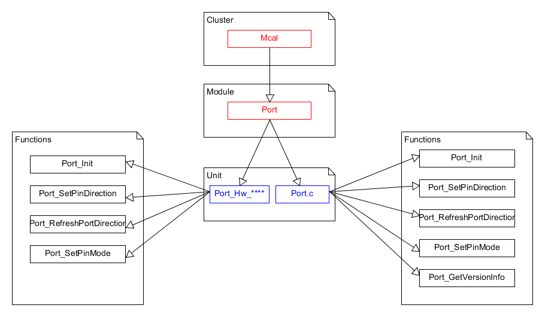

User Guide
===================

Source code and compilation
--------------------------------
The MCAL modules are delivered as source code by ARCCORE. As a customer you must ensure that the source code files are not modified, except for these files:
Generated by the configuration tool: Port_Cfg.h, Port_Lcfg.c and Port_PBcfg.c. 
For ARCCORE ASIL-D classification of the software to be valid, the software should be compiled with the same compiler as used in ARCCORE testing.  Refer to the test report provided by ARCCORE for the MPC5744P microcontroller.

Functional overview
--------------------

This module shall provide the service for initializing the peripherals of the micro controller. The port pins can be assigned to various functionalities, e.g.

 * GPIO
 * ADC
 * SPI
 * SCI
 * PWM
 * CAN
 * LIN etc.

For this reason, there shall be an overall configuration and initialization of this port structure.The configuration and mode of these port pins is micro controller and ECU dependent.
Port initialization data shall be written to each port configured. A validator check will be done to ensure that the same pins are not configured more than once. 
This Port shall complete the overall configuration and initialization of the port structure which is used in the Dio. Therefore, the Dio drives only pins that have already been configured by the Port.
The Port shall be initialized prior to use of the Dio functions. Otherwise Dio functions will exhibit undefined behavior.
The diagram below identifies the Port functions, and the structure of the module, unit and functions within the MCAL software layer.

