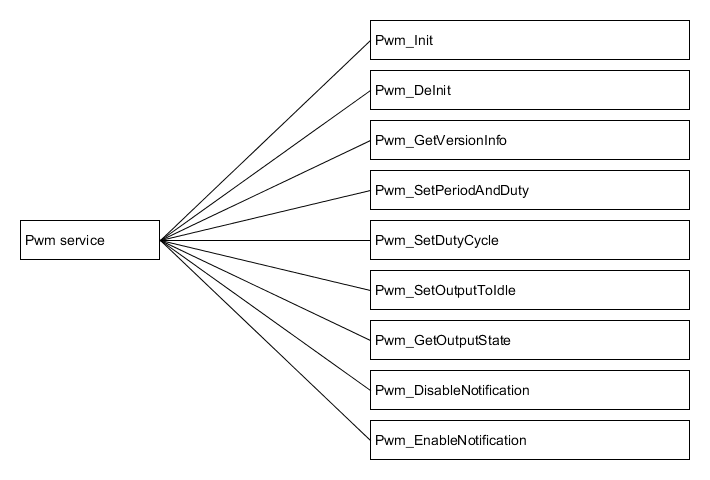
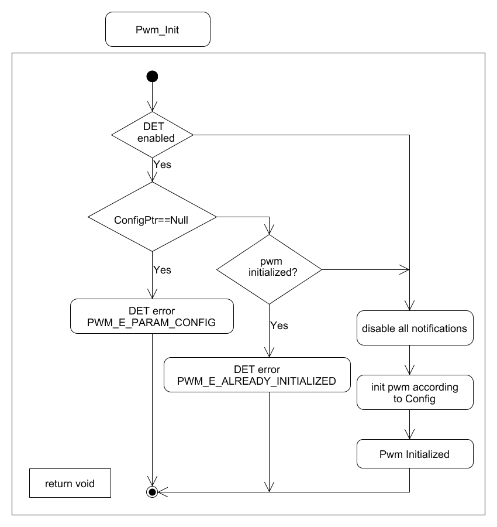
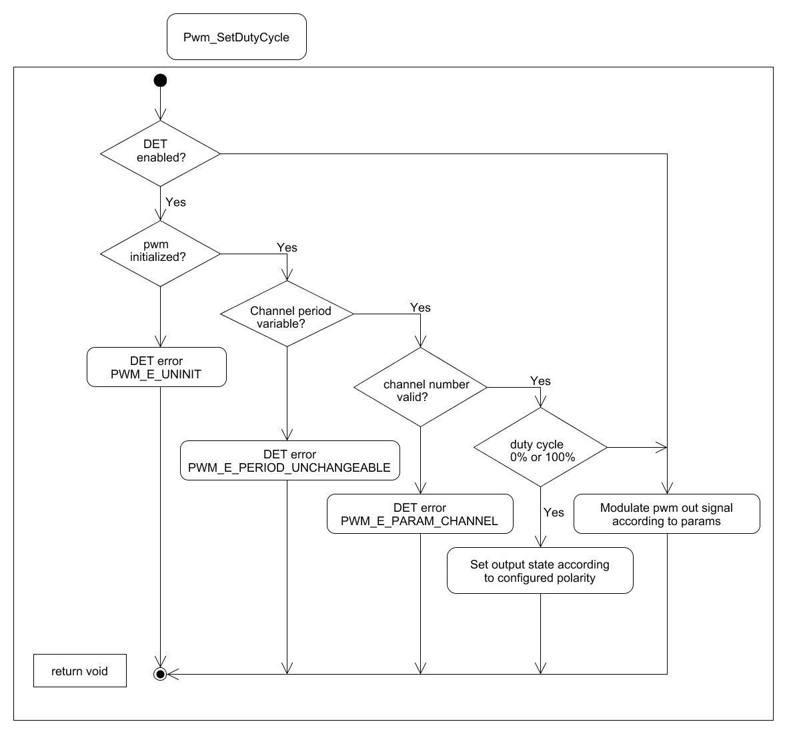
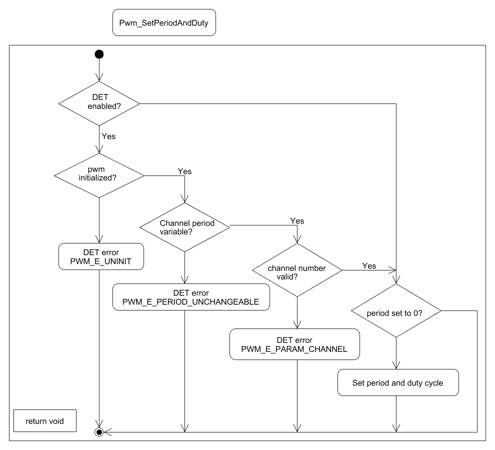
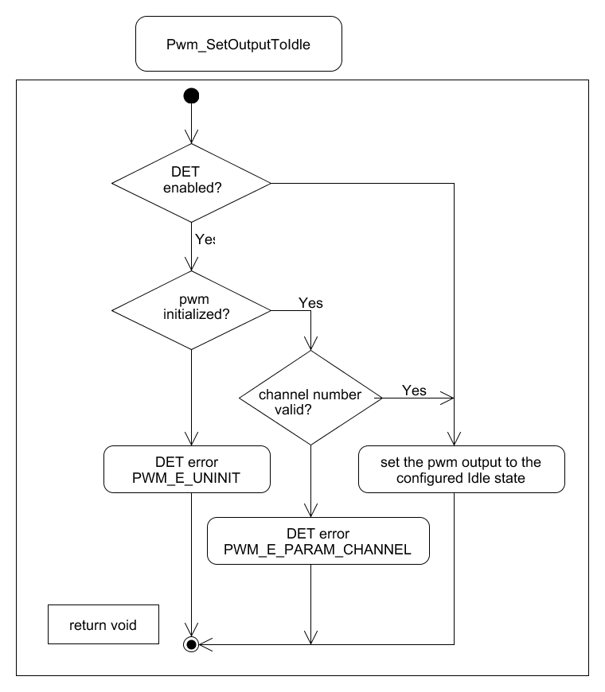
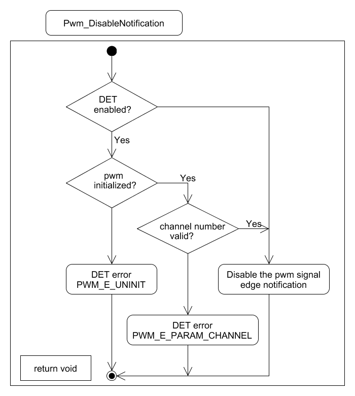
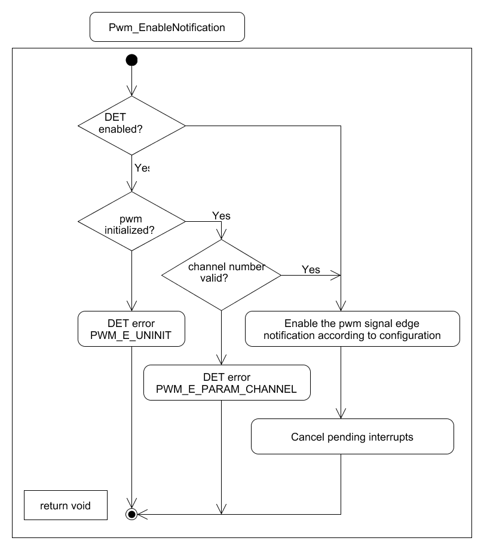

Dynamic design aspects of the software units
==================================================

Functionality and behaviour
------------------------------
The PWM provides the following services :

Control flow and concurrency of processes
-------------------------------------------------

All functions from the PWM module except Pwm_Init, Pwm_DeInit and Pwm_GetVersionInfo shall be re-entrant for different PWM channel numbers. The re-entrant functions can be invoked while already in the process of executing, so they are safe to be called from an interrupt.
The PWM module provides error detection mechanism.
Errors can be classified as development errors, run time errors, transient faults and production errors.
The detection of development errors is configurable (ON / OFF) at pre-compile time.
There are no runtime errors, transient faults or production errors.
The PWM module does not have scheduled functions.

List of parameters
^^^^^^^^^^^^^^^^^^^^^^

The parameters that each API should check are listed below. If the parameter check fails then the function should report with the corresponding error code.

+-------------------------+---------------------------------------+-------------------------------+
|       API               |  Parameter Check                      |  Error Code                   |
+=========================+=======================================+===============================+
|Pwm_Init                 |Pointer to configuration is null       |PWM_E_PARAM_CONFIG             |
|                         +---------------------------------------+-------------------------------+
|                         |Pwm module is already initialized      |PWM_E_ALREADY_INITIALIZED      |
+-------------------------+---------------------------------------+-------------------------------+
|Pwm_SetDutyCycle         |Pwm module uninitialized               |PWM_E_UNINIT*                  |
|                         +---------------------------------------+-------------------------------+
|                         |Channel period unchangeable            |PWM_E_PERIOD_UNCHANGEABLE      |
|                         +---------------------------------------+-------------------------------+
|                         |Valid channel number                   |PWM_E_PARAM_CHANNEL            |
+-------------------------+---------------------------------------+-------------------------------+
|Pwm_SetPeriodAndDuty     |Pwm module uninitialized               |PWM_E_UNINIT                   |
|                         +---------------------------------------+-------------------------------+
|                         |Channel period unchangeable            |PWM_E_PERIOD_UNCHANGEABLE      |
|                         +---------------------------------------+-------------------------------+
|                         |Valid channel number                   |PWM_E_PARAM_CHANNEL            |
+-------------------------+---------------------------------------+-------------------------------+
|Pwm_DeInit               |Pwm module uninitialized               |PWM_E_UNINIT                   |
+-------------------------+---------------------------------------+-------------------------------+
|Pwm_SetOutputToIdle      |Pwm module uninitialized               |PWM_E_UNINIT                   |
|                         +---------------------------------------+-------------------------------+
|                         |Valid channel number                   |PWM_E_PARAM_CHANNEL            |
+-------------------------+---------------------------------------+-------------------------------+
|Pwm_GetOutputState       |Pwm module uninitialized               |PWM_E_PARAM_CONFIG             |
|                         +---------------------------------------+-------------------------------+
|                         |Valid channel number                   |PWM_E_ALREADY_INITIALIZED      |
+-------------------------+---------------------------------------+-------------------------------+
|Pwm_DisableNotification  |Pwm module uninitialized               |PWM_E_PARAM_CONFIG             |
|                         +---------------------------------------+-------------------------------+
|                         |Valid channel number                   |PPWM_E_PARAM_CHANNEL           |
+-------------------------+---------------------------------------+-------------------------------+
|Pwm_EnableNotification   |Pwm module uninitialized               |PWM_E_UNINIT                   |
|                         +---------------------------------------+-------------------------------+
|                         |Valid channel number                   |PWM_E_PARAM_CHANNEL            |
+-------------------------+---------------------------------------+-------------------------------+
  \*The Pwm_E_UNINT is a ArcCore error code to provide backward compatibility with 4.1. 

Control flow  diagram
^^^^^^^^^^^^^^^^^^^^^^
 

The control flow diagram for Port_Init, Port_SetPinDirection ,Port_RefreshPortDirection and Port_GetVersionInfo are given below.

As described in the parameters are checked when the functions are called. If the check is failed Det error is reported.

Control flow diagram for Pwm Initialization:

Control flow diagram for Pwm De-initialization:

Control flow diagram for Set Duty Cycle:

Control flow diagram for Set period And Duty:

Control flow diagram for Set output to idle:

Control flow diagram for Get Output State:

.. image:: pictures/ControlFlowDiagramForGetOutputState.png

Control flow diagram for Disable Notification:

Control flow diagram for Enable Notification:

 