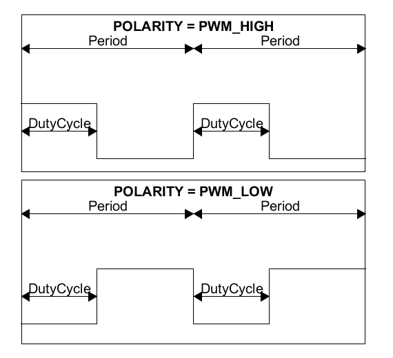
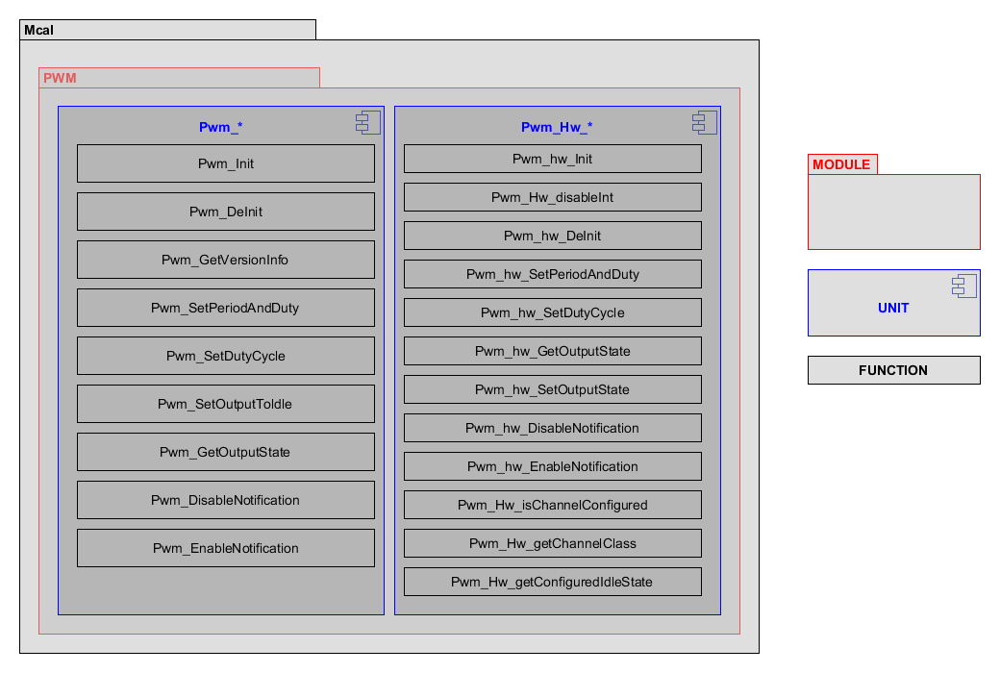

Introduction
================

This document specifies the functionality, API and the configuration of the AUTOSAR BSW Pwm driver.
Each Pwm channel is linked to a hardware PWM (pulse width modulation) unit which belongs to the microcontroller. 
The driver provides functions for initialization and control of the microcontroller internal PWM hw unit. The Pwm module generates pulses with variable pulse width. It allows the selection of the duty cycle and the signal period time. 

Static design aspects of the software units
==================================================

Software structure including its hierarchical levels
------------------------------------------------------------

The diagram below describing the software structur.

 

Data types and their characteristics
----------------------------------------
The PWM Module has its own type definitions and also uses imported types.
The imported types and its own type are described in chapter 8 "API Specification " of AUTOSAR requirements, Specifications of PWM Driver, ID: 037.

External interfaces of the software units
------------------------------------------------
The table below summarizes the application interfaces of the software units:

+--------------+-------------------+--------------------------------------------------------------------------------------------------------------------------+
|       API    |  Parameter Check  |  Error Code                                                                                                              |
+==============+===================+==========================================================================================================================+
|1             |PWM                |void Pwm_Init(const Pwm_ConfigType*  ConfigPtr).  ---------------------------------------------------                     |
|              |                   |PORT_E_DIRECTION_UNCHANGEABLE                                                                                             |
+--------------+-------------------+--------------------------------------------------------------------------------------------------------------------------+
|2             |PWM                |void Pwm_DeInit(void) -----------------------------------------------------------------------------------------           |
|              |                   |De-initializes the PWM module. Disables interrupts and outputs and sets them to idle state.                               |
+--------------+-------------------+--------------------------------------------------------------------------------------------------------------------------+
|3             |PWM                |void Pwm_SetDutyCycle(Pwm_ChannelType ChannelNumber, uint16 DutyCycle) --------------                                     |
|              |                   |Sets the duty cycle of the Pwm channel.                                                                                   |
+--------------+-------------------+--------------------------------------------------------------------------------------------------------------------------+
|4             |PWM                |void Pwm_SetPeriodAndDuty(Pwm_ChannelType ChannelNumber, Pwm_PeriodType Period, uint16 DutyCycle) ------------------------|
|              |                   |---------------------------------------------------------------- Sets the period and the duty cycle of a Pwm channel.     |
+--------------+-------------------+--------------------------------------------------------------------------------------------------------------------------+
|5             |PWM                |Pwm_OutputStateType Pwm_GetOutputState(Pwm_ChannelType ChannelNumber) --------------                                      |
|              |                   |Reads the internal state of the PWM output signal.                                                                        |
+--------------+-------------------+--------------------------------------------------------------------------------------------------------------------------+
|6             |PWM                |void Pwm_SetOutputToIdle(Pwm_ChannelType ChannelNumber) -----------------------------------                               |
|              |                   |Sets the PWM output to the configured Idle state.                                                                         |
+--------------+-------------------+--------------------------------------------------------------------------------------------------------------------------+
|7             |PWM                |void Pwm_DisableNotification(Pwm_ChannelType ChannelNumber) -----------------------------                                 |
|              |                   |Disables the Pwm signal edge notification.                                                                                |
+--------------+-------------------+--------------------------------------------------------------------------------------------------------------------------+
|8             |PWM                |void Pwm_EnableNotification(Pwm_ChannelType ChannelNumber, Pwm_EdgeNotification Type Notification)------------------------|
|              |                   |--------------------------------------------- Enables the PWM signal edge notification according to notification parameter|
+--------------+-------------------+--------------------------------------------------------------------------------------------------------------------------+
|9             |PWM                |uint32 Pwm_Arc_Tick2us (Pwm_ChannelType ChannelNumber,Pwm_PeriodType Period) -----                                        |
|              |                   |Converts system ticks to microseconds.                                                                                    |
+--------------+-------------------+--------------------------------------------------------------------------------------------------------------------------+
|10            |PWM                |Pwm_PeriodType Pwm_Arc_us2Tick( Pwm_ChannelType ChannelNumber,uint32 us) -----------                                      |
|              |                   |Converts microseconds to system ticks.                                                                                    |
+--------------+-------------------+--------------------------------------------------------------------------------------------------------------------------+
|11            |PWM                |void Pwm_GetVersionInfo(Std_VersionInfoType* versioninfo) --------------------------------------                          |
|              |                   |Returns the version information of this module.                                                                           |
+--------------+-------------------+--------------------------------------------------------------------------------------------------------------------------+

Constraints including the scope of the architecture and external dependencies
-----------------------------------------------------------------------------------
 * Most of the parts are generic since the header file defines the registers.
 * The PWM.c file contains the generic implementation of all the API mentioned in Port driver SWS document (ASR 4.3.0)
 * Pwm.h will have the standard API declarations.
 * The hardware specific implementations are done in Pwm_Hw_* .c file (depends on the architecture).
 * Each API will have the Det error check mentioned in PWM driver SWS document and will call the the hardware specific implementation function if the check passes.
 * Pwm_Internal.h will have the hardware specific API function declarations. Both Pwm.c and Pwm_Hw_*.c file will include Pwm_Internal.h
 * Pwm_Irq.c will have implementations of interrupt service routines used for event triggered notifications. For this reason it will include Pwm_Internal.h to have access to hardware specific routines for handling the interrupt services. 

Dependencies to other modules
--------------------------------

The PWM driver depends on the following modules:
 * Port Driver: To set the port pin functionality.
 * Mcu Driver: To set prescaler, core clock and PLL. The MPC5744P PWM hw clock is derived from the core clock by configuring a prescaller in range from 1 to 16. The Mcu driver will only set the core clock, but the Pwm driver will automatically select the correct prescaler to achieve the configured frequency.
 * Det: Development Error Tracer in Development mode. 

 
File strucure for <mcu>
--------------------------------

The file structure is defined by Autosar. see autosar_bsw

.. list-table:: List of MCAL files
  :widths: 50  50
  :header-rows: 1
  :align: left

  * - Generic files
    - MCAL specific files
  * - Pwm.c
    - Pwm_Hw_mpc5xxx.c
  * - 
    - 

The MCAL specific DD should list *<module name>* and *<arch name>*

