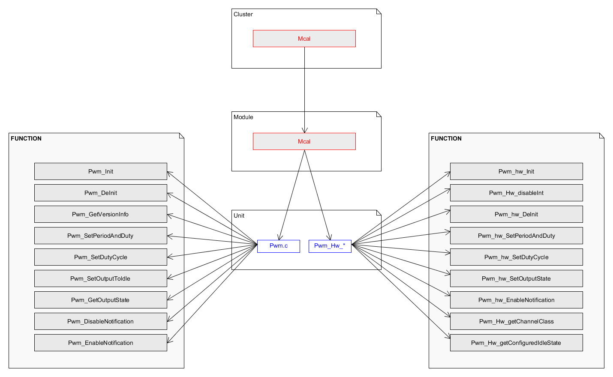

User Guide
===================

Source code and compilation
--------------------------------
The MCAL modules are delivered as source code by ARCCORE. As a customer you must ensure that the source code files are not modified, except for these files that generated by the configuration tool: Port_Cfg.h, Port_Lcfg.c and Port_PBcfg.c. 
For ARCCORE ASIL-D classification of the software to be valid, the software should be compiled with the same compiler as used in ARCCORE testing. Refer to the test report provided by ARCCORE for the MPC5744P microcontroller.

Functional overview
--------------------

This document specifies the functionality, API and the configuration of the AUTOSAR BSW PWM driver.
The PWM module is implemented according to AUTOSAR 4.3.0 Specification of PWM Driver. 
Depending on MCU the PWM driver is either implemented with eMIOS or FlexPwm.

