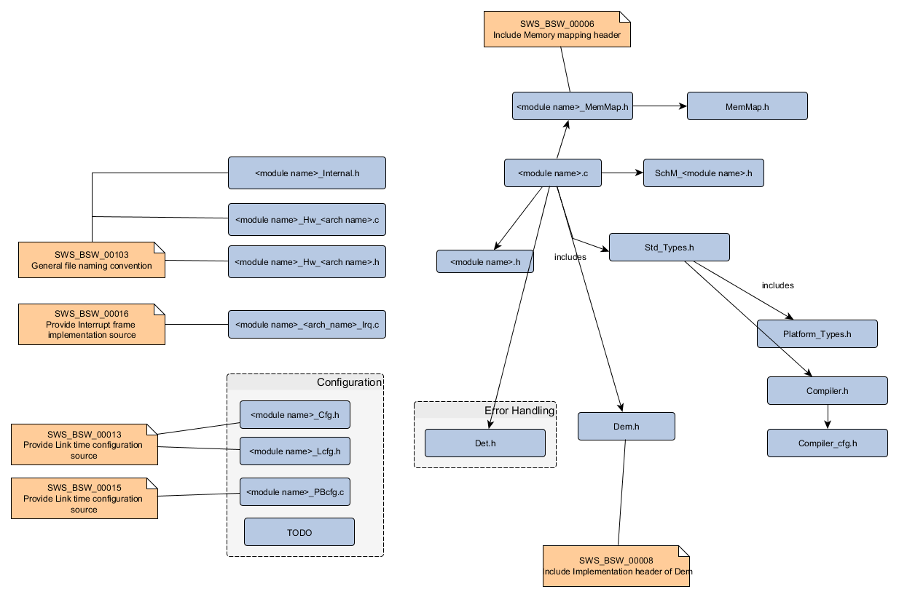

Design
===============
This manual is a design description of the Arccore MCAL.
 

Introduction
-----------------

Document Structure
-----------------------------

The following documents should exist for an MCAL

.. list-table:: Document Structure
  :widths: 50 50 
  :header-rows: 1
  :align: left

  * - Document
    - Description
  * - MCAL Design Description
    - Design document for all MCAL modules. This document.
  * - <module> Design Description
    - Design document for module <module> 
  * - User Documentation for <module> <arch>
    - User documentation for <module> of a specific architecture <arch>  
  * - Safety Manual for <module> 
    - User documentation for <module> of a specific architecture <arch>

.. todo:: 
  The document numbering it here:
  https://arccore.atlassian.net/wiki/spaces/BUS/pages/14876818/Product+documents+journal

Dependencies
-----------------------------

The legacy drivers in Arccore used to be one .c file for each driver. 
Improvements/bugs then affected one driver for each MCAL.
That was not very maintainable and there is always a risk that something is missed.
So it was decided to divide driver two different parts, one generic and one MCAL specific.
 
File structure
^^^^^^^^^^^^^^^^

The file structure is defined by Autosar. see autosar_bsw

.. todo:: 
  Fix reference above

The MCAL specific DD should list *<module name>* and *<arch name>*

.. todo:: 
  Names of *.arxml, *.yaml, *.xpt, *.chk files

Requirements
---------------------

Unit Report
^^^^^^^^^^^^^^^^

Code tagging
^^^^^^^^^^^^^^^^

https://arccore.atlassian.net/wiki/spaces/PD/pages/8323085/Unit+Report+Tool

#. How is the code tagged?
#. Why?
#. Functions that is not used by safety related project should still mark implemented features as just that. 
#. Add @safety tag for notes on safety in source code?

The unit report tool and the tagging format is quite flexible.

.. code-block:: c
  
  /** @reqSettings DEFAULT_SPECIFICATION_REVISION=4.1.2 */
  /** @tagSettings DEFAULT_ARCHITECTURE=ZYNQ|PPC|TMS570 */

  /** @req 4.3.0/SWS_Dio_00026 ...        (1) */
  /** @req 4.1.2|4.3.0/SWS_Dio_00027 ...  (2) */
  /** @req:TMS570 4.3.0/SWS_Dio_00028 ... (3) */
  /** @req SWS_Dio_00029 ...              (4) */
  
#. SWS_Dio_00026 is applied to 4.3.0 for ZYNQ|PPC|TMS570
#. SWS_Dio_00027 is applied to 4.1.2 and 4.3.0 for ZYNQ|PPC|TMS570
#. SWS_Dio_00028 is applied to 4.3.0 for TMS570
#. SWS_Dio_00029 is applied to 4.1.2 for ZYNQ|PPC|TMS570

Generic files should *NOT* contain any @req:<mcu> at all.
MCAL specific should use the normal @req without the <mcu> and specify 
the architecture in DEFAULT_ARCHITECTURE instead.     
  

Safety manual
^^^^^^^^^^^^^^^^

The safety manual should contain additional requirements on the MCAL that should
be applied by customer. The requirements should have the following format
ARC_INT_MCAL_<module>_<num>, where <module> is one the of MCAL modules and <num> is a 5
digit running number.

.. todo:: 
  https://arccore.atlassian.net/wiki/spaces/PD/pages/159682669/533+-+Safety+Manual+Dio+1.0

Example: 

.. list-table:: Requirements 
  :widths: 30 70
  :header-rows: 1
  :align: left

  * - Requirement
    - Description 
  * - ARC_INT_MCAL_DIO_00001
    - The user shall set the DioDevErrorDetect to True.

 

Doxygen
---------------------

#. Don't use MCAL specific wording in generic MCAL files (Dio.h, Can.c, etc)
#. All functions (Autosar and Arccore internal) shall be documented
#. M2: There shall be a brief description using tag \@brief.
#. All parameters shall be documented with \@param.
#. The attribute in/out/inout shall be used for every parameter.
#. The description of the returned value shall be documented with \@return
#. All possible return values shall be documented with \@retval, one per line.
#. Return void shall not be documented.
#. Reentracy shall be documented  with \@note
#. The addtogroup <ClusterName> and addtogroup <MolduleName> shall be used to include a modular documentation structure: Cluster, Module, Unit
#. If the description of the function is too big, \@details should be used
#. Const definitions shall be documented in the same line with /**< @brief <comment> */
#. Macros should be avoided according to AUTOSAR and Safety Requirements. If it can not avoided, Macros shall be documented as described in the Code Block in chapter Macros.
#. Structures, Typedefs etc. shall be documented as described in the examples below.
#. Const definitions may have a description header using \@name
#. Requirement tag: req shall be documented as described in the examples below
#. Requirement tag: reqSettings, tagSettings shall be documented as described in the examples below.

S

.. todo:: 
  https://arccore.atlassian.net/wiki/spaces/PD/pages/155985416/533+-+Doxygen+Comments+Guideline+PROPOSAL

Implementation
------------------
https://arccore.atlassian.net/wiki/spaces/PD/pages/57901062/Writing+MCAL+modules+-+DRAFT

Naming of units
^^^^^^^^^^^^^^^^^^^^^^^

The Autosar driver documentation contains a names such as module, channel, unit, controller. This chapter
aims to clarify how this is used in Arccore Core. 

Module is the name of the actual Autosar driver, e.g. AUTOSAR Basic Software module ADC driver.

From the HW perspective the module is implemented on one or many HW units. A HW unit is different
depending on driver. An ADC HW Unit is one Analog to Digital Converter (ADC). For CAN a CAN HW unit
are all CAN controllers on a MCU that the CAN driver handles.

Channge

Depending on driver we have a number of different    
HW Unit - Adc

CAN 
Controller 

 

  
In Autosar the UnitId/channelId is usually something that runs in a sequence from 0 and up. Configuring for example unit C out of A, B and C will force the driver to have a concept of logical and physical channels.
It's assumed that the Autosar driver API will use the logical channels (always starting from 0) and the HW dependent code should use physical channels. If possible use the same names for the functions that go between

